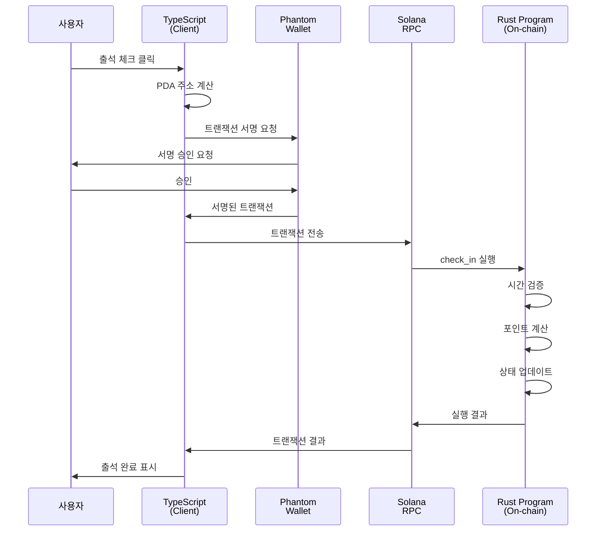

# BAY 출석체크 시스템 - Rust & TypeScript 코드 흐름 🔄

## 📍 기본 개념

### **Rust 코드 (`.rs`)**
- **역할**: 솔라나 블록체인에서 실행되는 **스마트 컨트랙트(프로그램)** 코드
- **위치**: `programs/bay_attendance_check/src/` 폴더
- **실행 환경**: 솔라나 블록체인 상에서 직접 실행

### **TypeScript 코드 (`.ts`)**
- **역할**: 사용자가 컨트랙트와 상호작용하기 위한 **클라이언트 코드**
- **위치**: `scripts/` 폴더, `tests/` 폴더
- **실행 환경**: 사용자의 컴퓨터에서 실행

## 🔗 작동 방식

```
[사용자 컴퓨터]          [솔라나 블록체인]
     |                        |
  TS 코드 실행               |
     |                        |
  트랜잭션 생성              |
     | ------------------>    |
     |                     RS 코드 실행
     |                        |
     | <------------------    |
  결과 수신                   |
```

## 📝 코드 비교 예시

### 1. **데이터 구조 정의**

**Rust (state.rs)**
```rust
#[account]
pub struct Member {
    pub wallet: Pubkey,
    pub role: MemberRole,
    pub total_attendance: u32,
    pub total_late: u32,
    pub total_absence: u32,
    pub total_points: u64,
    pub is_active: bool,
    pub bump: u8,
}
```

**TypeScript (자동 생성된 타입)**
```typescript
export type Member = {
  wallet: PublicKey
  role: MemberRole
  totalAttendance: number
  totalLate: number
  totalAbsence: number
  totalPoints: BN
  isActive: boolean
  bump: number
}
```

### 2. **함수 호출 비교**

**Rust (lib.rs) - 컨트랙트 정의**
```rust
#[program]
pub mod bay_attendance_check {
    pub fn initialize_member(
        ctx: Context<InitializeMember>, 
        role: MemberRole
    ) -> Result<()> {
        // 실제 로직 실행
        instructions::initialize_member(ctx, role)
    }
}
```

**TypeScript (admin.ts) - 컨트랙트 호출**
```typescript
const tx = await program.methods
    .initializeMember({ admin: {} })  // 함수 이름이 camelCase로 변환됨
    .accounts({
        authority: adminKeypair.publicKey,
        admin: adminKeypair.publicKey,
        memberWallet: adminKeypair.publicKey,
    })
    .signers([adminKeypair])
    .rpc();
```

## 🔄 전체 흐름 설명

### 1. **컨트랙트 배포 과정**
```bash
# 1. Rust 코드 컴파일
anchor build
# → .so 파일 생성 (솔라나가 실행할 수 있는 바이너리)

# 2. 솔라나에 배포
anchor deploy
# → 프로그램이 블록체인에 업로드됨

# 3. IDL 생성
# → TypeScript가 사용할 인터페이스 정의 생성
```

### 2. **클라이언트 실행 과정**

**TypeScript 코드가 하는 일:**
```typescript
// 1. 프로그램 연결
const program = anchor.workspace.BayAttendanceCheck;

// 2. 트랜잭션 생성
const tx = await program.methods
    .checkIn()  // Rust의 check_in 함수 호출
    .accounts({
        // 필요한 계정들 지정
        memberWallet: wallet.publicKey,
        session: sessionPDA,
    })
    .signers([wallet])  // 서명
    .rpc();  // 블록체인에 전송

// 3. 결과 확인
const memberData = await program.account.member.fetch(memberPDA);
```

## 🎯 핵심 차이점

### **Rust 코드**
- ✅ 실제 비즈니스 로직 구현
- ✅ 데이터 검증 및 저장
- ✅ 포인트 계산 및 지급
- ✅ 권한 확인
- ❌ 사용자와 직접 상호작용 불가

### **TypeScript 코드**
- ✅ 사용자 인터페이스 제공
- ✅ 지갑 연결 관리
- ✅ 트랜잭션 생성 및 전송
- ✅ 결과 표시
- ❌ 직접적인 데이터 수정 불가

## 🔧 실제 예시: 출석 체크 흐름

### 1. **사용자가 출석 체크 버튼 클릭**

### 2. **TypeScript (member.ts)**
```typescript
// 트랜잭션 준비 및 전송
const tx = await program.methods
    .checkIn()
    .accounts({ memberWallet: wallet.publicKey })
    .signers([wallet])
    .rpc();
```

### 3. **Rust (check_in.rs)**
```rust
pub fn check_in(ctx: Context<CheckIn>) -> Result<()> {
    // 시간 확인
    let current_time = Clock::get()?.unix_timestamp;
    
    // 출석 상태 결정
    let (status, points) = if current_time <= session.start_time {
        (AttendanceStatus::Present, 10u8)
    } else if current_time <= session.late_time {
        (AttendanceStatus::Late, 5u8)
    } else {
        return Err(AttendanceError::CheckInTimePassed.into());
    };
    
    // 포인트 지급
    member.total_points += points as u64;
    
    Ok(())
}
```

### 4. **결과 반환 및 표시 (TypeScript)**
```typescript
console.log("출석 체크 완료!");
console.log("획득 포인트:", points);
```

## 🌊 전체 플로우 다이어그램



## 📊 데이터 흐름

### **1. 계정 생성 흐름**
```
TypeScript                    Rust
    |                          |
PDA 주소 계산                  |
    |                          |
init 트랜잭션 생성             |
    | ----------------------> |
    |                      계정 생성
    |                      데이터 초기화
    | <---------------------- |
계정 생성 완료                 |
```

### **2. 데이터 조회 흐름**
```
TypeScript                    Rust
    |                          |
fetch() 호출                   |
    | ----------------------> |
    |                      데이터 읽기
    | <---------------------- |
데이터 표시                    |
```

## 🔑 중요 개념

### **PDA (Program Derived Address)**
- **TypeScript에서**: `PublicKey.findProgramAddressSync()` 로 계산
- **Rust에서**: `seeds` 와 `bump` 로 검증
- **동일한 seed는 항상 동일한 주소 생성**

### **IDL (Interface Definition Language)**
- **역할**: Rust 함수를 TypeScript에서 사용할 수 있게 변환
- **생성**: `anchor build` 시 자동 생성
- **위치**: `target/idl/bay_attendance_check.json`

### **트랜잭션 서명**
- **TypeScript**: `.signers([keypair])` 로 서명자 지정
- **Rust**: `Signer<'info>` 타입으로 서명 검증

## 📚 요약

1. **Rust 코드**: 블록체인에서 실행되는 핵심 비즈니스 로직
2. **TypeScript 코드**: 사용자와 블록체인을 연결하는 인터페이스
3. **IDL**: 두 언어 간의 통신 프로토콜 정의
4. **트랜잭션**: TypeScript에서 생성, Rust에서 실행

모든 상태 변경은 반드시 Rust 프로그램을 통해서만 가능하며, TypeScript는 단지 그 요청을 전달하는 역할을 합니다!