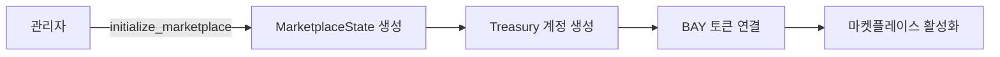
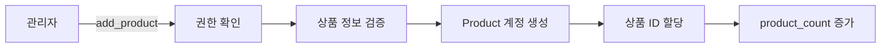
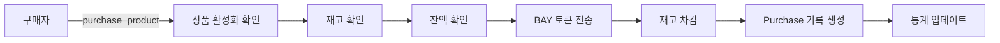

# BAY Point Marketplace 컨트랙트 가이드

## 📌 목차
1. [개요](#개요)
2. [기본 구조](#기본-구조)
3. [Account 구조체](#account-구조체)
4. [Program 함수](#program-함수)
5. [Instruction 계정 구조](#instruction-계정-구조)
6. [에러 처리](#에러-처리)
7. [작동 흐름](#작동-흐름)
8. [사용 예시](#사용-예시)

---

## 개요

BAY Point Marketplace는 Solana 블록체인 위에서 동작하는 탈중앙화 마켓플레이스 스마트 컨트랙트입니다. 사용자들이 BAY 토큰을 사용하여 상품을 등록하고 구매할 수 있는 플랫폼을 제공합니다.

### 주요 특징
- **BAY 토큰 기반 거래**: Token-2022 프로그램을 사용한 BAY 토큰으로 결제
- **관리자 권한 시스템**: 마켓플레이스 초기화 및 상품 관리는 관리자만 가능
- **PDA (Program Derived Address)**: 안전한 계정 관리를 위한 PDA 사용
- **상품 관리**: 상품 추가, 수정, 비활성화 기능
- **구매 내역 추적**: 모든 구매 내역을 온체인에 저장

### Program ID
```
8NPWArWjjQthDGGLppygtwwSMtUtajt4jpzVsfu98RAo
```

---

## 기본 구조

```
bay_point_marketplace/
├── src/
│   ├── lib.rs              # 메인 프로그램 진입점
│   ├── state.rs            # 데이터 구조체 정의
│   ├── errors.rs           # 에러 타입 정의
│   └── instructions/       # 각 기능별 명령어 구현
│       ├── initialize.rs   # 마켓플레이스 초기화
│       ├── product_management.rs  # 상품 관리
│       └── purchase.rs     # 구매 처리
```

---

## Account 구조체

### 1. MarketplaceState
마켓플레이스의 전체 상태를 관리하는 핵심 계정입니다.

```rust
pub struct MarketplaceState {
    pub admin: Pubkey,           // 관리자 주소
    pub token_mint: Pubkey,      // BAY 토큰 민트 주소
    pub treasury: Pubkey,        // 수익금 보관 주소
    pub product_count: u64,      // 등록된 상품 총 개수
    pub total_sales: u64,        // 총 판매액
    pub is_initialized: bool,    // 초기화 여부
    pub bump: u8,                // PDA bump seed
}
```

**역할**:
- 마켓플레이스의 메타데이터 저장
- 관리자 권한 검증
- 상품 카운터 및 판매 통계 관리

### 2. Product
개별 상품 정보를 저장하는 계정입니다.

```rust
pub struct Product {
    pub id: u64,                 // 상품 고유 ID
    pub marketplace: Pubkey,     // 소속 마켓플레이스
    pub name: String,            // 상품명 (최대 64자)
    pub description: String,     // 상품 설명 (최대 256자)
    pub price: u64,              // 가격 (BAY 토큰 단위)
    pub stock: u64,              // 재고 수량
    pub sold_count: u64,         // 판매된 수량
    pub is_active: bool,         // 활성화 상태
    pub seller: Pubkey,          // 판매자 주소
    pub created_at: i64,         // 생성 시간
    pub updated_at: i64,         // 수정 시간
    pub bump: u8,                // PDA bump seed
}
```

**역할**:
- 상품의 모든 정보 저장
- 재고 및 판매 추적
- 상품 상태 관리

### 3. Purchase
구매 내역을 기록하는 계정입니다.

```rust
pub struct Purchase {
    pub id: u64,                 // 구매 ID
    pub product_id: u64,         // 구매한 상품 ID
    pub buyer: Pubkey,           // 구매자 주소
    pub quantity: u64,           // 구매 수량
    pub total_price: u64,        // 총 결제 금액
    pub timestamp: i64,          // 구매 시간
    pub bump: u8,                // PDA bump seed
}
```

**역할**:
- 구매 내역 영구 저장
- 거래 증명 및 추적

---

## Program 함수

### 1. initialize_marketplace
마켓플레이스를 최초로 설정합니다.

```rust
pub fn initialize_marketplace(ctx: Context<InitializeMarketplace>) -> Result<()>
```

**기능**:
- 마켓플레이스 계정 생성
- 관리자 설정
- Treasury (수익금 보관소) 생성
- BAY 토큰 민트 연결

### 2. add_product
새로운 상품을 등록합니다.

```rust
pub fn add_product(
    ctx: Context<AddProduct>,
    name: String,
    description: String,
    price: u64,
    stock: u64,
) -> Result<()>
```

**기능**:
- 상품 정보 검증 (이름 길이, 가격, 재고)
- 새 상품 계정 생성
- 상품 ID 자동 할당
- 마켓플레이스 상품 카운터 증가

### 3. update_product
기존 상품 정보를 수정합니다.

```rust
pub fn update_product(
    ctx: Context<UpdateProduct>,
    price: Option<u64>,
    stock: Option<u64>,
) -> Result<()>
```

**기능**:
- 관리자 권한 확인
- 가격 또는 재고 수정 (선택적)
- 수정 시간 업데이트

### 4. deactivate_product
상품을 비활성화합니다.

```rust
pub fn deactivate_product(ctx: Context<DeactivateProduct>) -> Result<()>
```

**기능**:
- 관리자 권한 확인
- 상품 상태를 비활성화로 변경
- 구매 불가능 상태로 전환

### 5. purchase_product
상품을 구매합니다.

```rust
pub fn purchase_product(
    ctx: Context<PurchaseProduct>,
    product_id: u64,
    quantity: u64,
) -> Result<()>
```

**기능**:
- 상품 활성화 상태 확인
- 재고 확인
- 구매자 잔액 확인
- BAY 토큰 전송 (구매자 → Treasury)
- 재고 차감 및 판매 통계 업데이트
- 구매 내역 생성

---

## Instruction 계정 구조

### InitializeMarketplace 계정 구조

```rust
#[derive(Accounts)]
pub struct InitializeMarketplace<'info> {
    #[account(
        init,
        payer = admin,
        space = MarketplaceState::LEN,
        seeds = [b"marketplace", admin.key().as_ref()],
        bump
    )]
    pub marketplace: Account<'info, MarketplaceState>,
    
    pub token_mint: Box<InterfaceAccount<'info, Mint>>,
    
    #[account(
        init,
        payer = admin,
        token::mint = token_mint,
        token::authority = marketplace,
        seeds = [b"treasury", marketplace.key().as_ref()],
        bump
    )]
    pub treasury: Box<InterfaceAccount<'info, TokenAccount>>,
    
    #[account(mut)]
    pub admin: Signer<'info>,
    
    pub system_program: Program<'info, System>,
    pub token_program: Interface<'info, TokenInterface>,
    pub rent: Sysvar<'info, Rent>,
}
```

**PDA Seeds**:
- Marketplace: `["marketplace", admin_pubkey]`
- Treasury: `["treasury", marketplace_pubkey]`

### AddProduct 계정 구조

```rust
#[derive(Accounts)]
pub struct AddProduct<'info> {
    #[account(
        mut,
        seeds = [b"marketplace", marketplace.admin.as_ref()],
        bump = marketplace.bump
    )]
    pub marketplace: Account<'info, MarketplaceState>,
    
    #[account(
        init,
        payer = admin,
        space = Product::LEN,
        seeds = [
            b"product",
            marketplace.key().as_ref(),
            marketplace.product_count.to_le_bytes().as_ref()
        ],
        bump
    )]
    pub product: Account<'info, Product>,
    
    #[account(mut)]
    pub admin: Signer<'info>,
    
    pub system_program: Program<'info, System>,
}
```

**PDA Seeds**:
- Product: `["product", marketplace_pubkey, product_id]`

### PurchaseProduct 계정 구조

```rust
#[derive(Accounts)]
#[instruction(product_id: u64)]
pub struct PurchaseProduct<'info> {
    #[account(mut)]
    pub marketplace: Account<'info, MarketplaceState>,
    
    pub token_mint: Box<InterfaceAccount<'info, Mint>>,
    
    #[account(mut)]
    pub product: Account<'info, Product>,
    
    #[account(
        init,
        payer = buyer,
        space = Purchase::LEN,
        seeds = [
            b"purchase",
            buyer.key().as_ref(),
            marketplace.total_sales.to_le_bytes().as_ref()
        ],
        bump
    )]
    pub purchase: Account<'info, Purchase>,
    
    #[account(mut)]
    pub buyer_token_account: Box<InterfaceAccount<'info, TokenAccount>>,
    
    #[account(mut)]
    pub treasury: Box<InterfaceAccount<'info, TokenAccount>>,
    
    #[account(mut)]
    pub buyer: Signer<'info>,
    
    pub token_program: Interface<'info, TokenInterface>,
    pub system_program: Program<'info, System>,
}
```

**PDA Seeds**:
- Purchase: `["purchase", buyer_pubkey, purchase_id]`

---

## 에러 처리

### MarketplaceError 열거형

```rust
#[error_code]
pub enum MarketplaceError {
    Unauthorized,           // 권한 없음
    AlreadyInitialized,     // 이미 초기화됨
    NotInitialized,         // 초기화되지 않음
    NameTooLong,           // 상품명이 너무 김
    DescriptionTooLong,    // 설명이 너무 김
    InvalidPrice,          // 잘못된 가격 (0 이하)
    InvalidStock,          // 잘못된 재고 (0 이하)
    ProductNotActive,      // 비활성화된 상품
    ProductNotFound,       // 상품을 찾을 수 없음
    InsufficientStock,     // 재고 부족
    InvalidQuantity,       // 잘못된 수량
    InsufficientBalance,   // 잔액 부족
    Overflow,              // 정수 오버플로우
    InvalidTokenMint,      // 잘못된 토큰 민트
    InvalidTreasury,       // 잘못된 Treasury
}
```

---

## 작동 흐름

### 1. 마켓플레이스 초기화 흐름



### 2. 상품 등록 흐름



### 3. 구매 흐름



---

## 사용 예시

### 1. 마켓플레이스 초기화 (TypeScript)

```typescript
// 필요한 PDA 계산
const [marketplacePda] = PublicKey.findProgramAddressSync(
  [Buffer.from("marketplace"), admin.publicKey.toBuffer()],
  program.programId
);

const [treasuryPda] = PublicKey.findProgramAddressSync(
  [Buffer.from("treasury"), marketplacePda.toBuffer()],
  program.programId
);

// 초기화 트랜잭션
const tx = await program.methods
  .initializeMarketplace()
  .accounts({
    marketplace: marketplacePda,
    tokenMint: tokenMint,
    treasury: treasuryPda,
    admin: admin.publicKey,
    systemProgram: SystemProgram.programId,
    tokenProgram: TOKEN_PROGRAM_ID,
    rent: SYSVAR_RENT_PUBKEY,
  })
  .signers([admin])
  .rpc();
```

### 2. 상품 추가

```typescript
const [productPda] = PublicKey.findProgramAddressSync(
  [
    Buffer.from("product"),
    marketplacePda.toBuffer(),
    new BN(productId).toArrayLike(Buffer, "le", 8)
  ],
  program.programId
);

const tx = await program.methods
  .addProduct(
    "테스트 상품",           // name
    "이것은 테스트 상품입니다", // description
    new BN(100 * 10 ** 9),   // price (100 BAY)
    new BN(10)               // stock
  )
  .accounts({
    marketplace: marketplacePda,
    product: productPda,
    admin: admin.publicKey,
    systemProgram: SystemProgram.programId,
  })
  .signers([admin])
  .rpc();
```

### 3. 상품 구매

```typescript
const [purchasePda] = PublicKey.findProgramAddressSync(
  [
    Buffer.from("purchase"),
    buyer.publicKey.toBuffer(),
    new BN(purchaseId).toArrayLike(Buffer, "le", 8)
  ],
  program.programId
);

const tx = await program.methods
  .purchaseProduct(
    new BN(0),    // product_id
    new BN(2)     // quantity
  )
  .accounts({
    marketplace: marketplacePda,
    tokenMint: tokenMint,
    product: productPda,
    purchase: purchasePda,
    buyerTokenAccount: buyerTokenAccount,
    treasury: treasuryPda,
    buyer: buyer.publicKey,
    tokenProgram: TOKEN_PROGRAM_ID,
    systemProgram: SystemProgram.programId,
  })
  .signers([buyer])
  .rpc();
```

### 4. 상품 정보 조회

```typescript
// 마켓플레이스 정보 조회
const marketplaceAccount = await program.account.marketplaceState.fetch(marketplacePda);
console.log("총 상품 수:", marketplaceAccount.productCount.toString());
console.log("총 판매액:", marketplaceAccount.totalSales.toString());

// 상품 정보 조회
const productAccount = await program.account.product.fetch(productPda);
console.log("상품명:", productAccount.name);
console.log("가격:", productAccount.price.toString());
console.log("재고:", productAccount.stock.toString());

// 구매 내역 조회
const purchaseAccount = await program.account.purchase.fetch(purchasePda);
console.log("구매 수량:", purchaseAccount.quantity.toString());
console.log("총 결제액:", purchaseAccount.totalPrice.toString());
```

---

## 보안 고려사항

1. **권한 관리**: 관리자만 상품을 추가/수정/비활성화할 수 있음
2. **PDA 사용**: 모든 계정은 PDA로 생성되어 프로그램만 제어 가능
3. **오버플로우 방지**: 모든 수학 연산에 checked 연산 사용
4. **입력 검증**: 모든 입력값에 대한 유효성 검사
5. **토큰 검증**: 올바른 토큰 민트 사용 여부 확인

---

## 개발 환경 설정

### 필수 요구사항
- Rust 1.70.0+
- Anchor 0.30.0+
- Solana CLI 1.18.0+
- Node.js 18+
- Yarn 또는 npm

### 로컬 개발 명령어

```bash
# 빌드
anchor build

# 테스트
anchor test

# 배포 (devnet)
anchor deploy --provider.cluster devnet

# 로컬 유효성 검사기 실행
solana-test-validator

# 로컬 배포
anchor deploy --provider.cluster localnet
```

---

## 트러블슈팅

### 일반적인 문제 해결

1. **"Account does not exist" 에러**
   - PDA 주소 계산이 올바른지 확인
   - Seeds가 정확한지 검증

2. **"Insufficient balance" 에러**
   - 구매자의 BAY 토큰 잔액 확인
   - 토큰 계정이 올바르게 생성되었는지 확인

3. **"Unauthorized" 에러**
   - 관리자 권한이 필요한 작업인지 확인
   - 서명자가 올바른지 검증

4. **Token decimals 문제**
   - BAY 토큰은 9 decimals 사용
   - 가격 계산 시 decimals 고려

---

## 추가 리소스

- [Anchor Framework 문서](https://www.anchor-lang.com/)
- [Solana 개발자 문서](https://docs.solana.com/)
- [Token-2022 프로그램 가이드](https://spl.solana.com/token-2022)

---

## 문의 및 지원

프로젝트 관련 문의사항이나 버그 리포트는 GitHub Issues를 통해 제출해주세요.